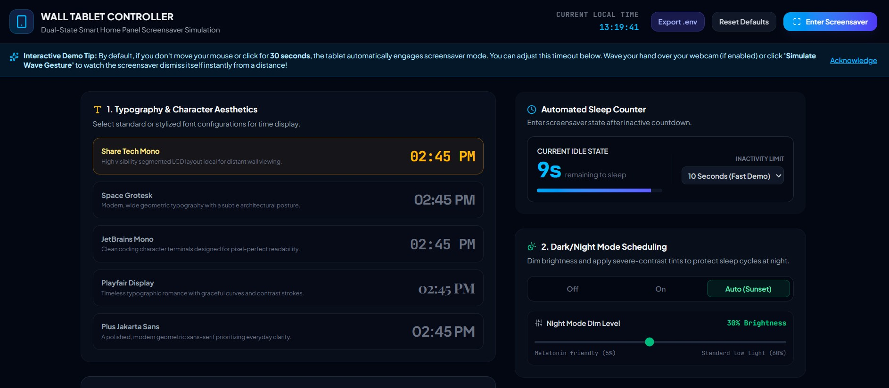
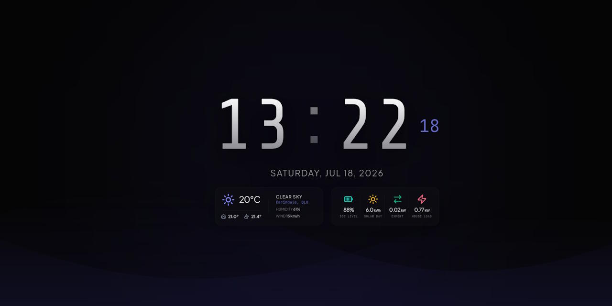

# HAura

HAura is a premium, elegant, and fully customizable dual-state screensaver and dashboard designed for wall-mounted smart tablets (e.g., Android tablets, iPads). It integrates directly with **Home Assistant** to show live telemetry (battery state of charge, solar generation, load demand, grid flow, and temperature) and uses **Open-Meteo** to display hyper-local weather reports.

Designed with rich glassmorphism aesthetics, dynamic color palettes, and fluid micro-animations, HAura is optimized to look stunning on both low-light bedroom panels and bright living room dashboards.

---

## 📸 Screenshots

| 🖥️ Config Screen (`?setup=true` or `?config=true`) | 🌌 Active Screensaver |
|:---:|:---:|
|  |  |

---

## 🌟 Key Features

- **Adaptive Color Palettes**: Transitions automatically between four beautiful ambient themes (Morning Warm Amber, Afternoon Cyan Breeze, Evening Sunset Coral, and Midnight Velvet) depending on the hour of the day.
- **Home Assistant Telemetry**: Syncs seamlessly with local HA sensors to display your home energy stats (battery SoC, current load, PV solar yield, grid flow) and indoor/outdoor temperatures.
- **Webcam Motion Auto-Wake**: Uses your tablet's built-in front camera to sense movement and automatically wake the display from the screensaver state.
- **Burn-In Drift Protection**: Protects always-on AMOLED/LCD screens by slowly shifting layout elements at regular intervals.
- **Melatonin-Friendly Night Mode**: Auto-dims the display and applies high-contrast filters during night hours to prevent sleep cycle disruption.
- **Customizable Typography**: Switch between shareable digital, spaces, mono, serif, and modern geometric fonts directly from the UI.

---

## ⚡ Quick Start

### Prerequisites

- [Node.js](https://nodejs.org/) (v18.0.0 or higher)
- npm (installed automatically with Node)

### Setup & Run Locally

1. **Clone the repository**:

   ```bash
   git clone https://github.com/yourusername/haura.git
   cd haura
   ```

2. **Install dependencies**:

   ```bash
   npm install
   ```

3. **Configure environment variables**:
   Copy `.env.example` to create your own `.env` file:

   ```bash
   cp .env.example .env
   ```

   Modify the `.env` file using the configuration reference below.

4. **Start the development server**:

   ```bash
   npm run dev
   ```

   The application will start on `http://localhost:3000`.
   - To open the **dashboard setup/config panel**, navigate to: `http://localhost:3000/?setup=true`
   - To launch directly into the **active screensaver mode**, go to: `http://localhost:3000/`

---

## 🔌 Connecting Home Assistant Sensors

HAura uses standard REST API queries to fetch live states from Home Assistant.

### 1. Generate a Long-Lived Access Token (LLAT)

To authenticate, you must generate a token in Home Assistant:

1. Log into your Home Assistant UI.
2. Click on your profile name at the bottom left of the sidebar.
3. Scroll to the very bottom of the page and click **"Create Token"** under the *Long-Lived Access Tokens* section.
4. Copy the generated token and keep it secure (you will paste this into `VITE_HA_TOKEN`).

### 2. Configure Environment Variables

Edit your `.env` file to match your Home Assistant configuration:

```env
# Home Assistant Connection
VITE_HA_URL="http://192.168.1.150:8123" # Your HA local IP or domain
VITE_HA_TOKEN="your_long_lived_access_token_here"

# Sensor Entity IDs (Check Developer Tools -> States in HA)
VITE_HA_ENTITY_BATTERY_SOC="sensor.foxess_bat_soc"      # Battery Charge Level (%)
VITE_HA_ENTITY_INV_BAT_POWER="sensor.foxess_bat_power"  # Battery charge/discharge power (kW)
VITE_HA_ENTITY_GRID_CT="sensor.foxess_grid_ct"          # Power grid Import/Export (kW)
VITE_HA_ENTITY_SOLAR_TODAY="sensor.foxess_solar_today"  # Daily cumulative PV yield (kWh)
VITE_HA_ENTITY_HOUSE_LOAD="sensor.foxess_house_load"    # Household electricity load (kW)
VITE_HA_ENTITY_INDOOR_TEMP="sensor.indoor_temperature"  # Indoor temperature sensor (°C/°F)
VITE_HA_ENTITY_OUTDOOR_TEMP="sensor.outdoor_temperature" # Outdoor temperature sensor (°C/°F)
```

### 🛠️ Interactive Config Generator (.env Export)

Instead of hand-writing your `.env` settings, you can configure the screensaver visually:
1. Open the configuration deck by loading the app in setup mode: `http://localhost:3000/?setup=true`
2. Fill in your Home Assistant URL, Access Token, and entity mappings in the **Home Assistant & FoxESS Modbus** config card.
3. Tweak your preferences (typography styles, timeouts, night mode brightness thresholds, and coordinates).
4. Click **"Test Connection"** to validate that HAura can successfully query your HA telemetry.
5. Once your integration verifies successfully, click the **"Export .env"** button in the top-right header menu.
6. Copy the generated configuration snippet, paste it directly into your root `.env` file, and restart the dev server to apply!

> [!IMPORTANT]
> **CORS / Mixed Content Warning**
>
> If you run the web screensaver over a secure `https://` connection (e.g. deployed on GitHub Pages or Cloudflare), web browsers will block requests to local HTTP IPs (like `http://192.168.1.x:8123`) due to **mixed content security policies**.
>
> To resolve this, either:
>
> 1. Host this app locally and access it over plain HTTP (`http://localhost:3000` or `http://<your-local-ip>:3000`).
> 2. Enable CORS in Home Assistant by adding the following to your `configuration.yaml` and restarting:
>
>    ```yaml
>    http:
>      cors_allowed_origins:
>        - "http://localhost:3000"
>        - "http://192.168.1.x:3000" # Add tablet's IP if hosted elsewhere
>    ```

---

## 📱 Dedicated Tablet Setup via Free Kiosk

To run HAura as a permanent, dedicated screensaver on an Android wall tablet, we recommend using the free, open-source **[Free Kiosk app](https://freekiosk.app/)**:

1. Install the **Free Kiosk** application on your Android device.
2. In the app settings, set the **Kiosk URL** to your hosted screensaver address:
   - For configuration access: `http://<your-ip>:3000/?setup=true`
   - For permanent screensaver view: `http://<your-ip>:3000/`
3. Turn on the **Auto-Start on Boot** and **Lock Task Mode** configurations inside Free Kiosk.
4. Set the inactivity settings in the HAura UI (e.g., auto-sleep after 60 seconds). Once inactive, the screen will switch to the gorgeous minimalist screensaver. A simple touch anywhere will immediately wake the tablet back up to the setup dashboard if needed.

---

## 🛠️ Production Build & Deployment

### Build Locally
To compile and optimize the application for a standalone web server deployment:

```bash
npm run build
```

This generates a static build in the `/dist` directory.

### Automated SFTP Deployment

You can automatically compile and upload the app to your server (e.g., `192.168.0.5`) over SFTP:

1. Configure your server credentials in `.env`:
   ```env
   SFTP_HOST="192.168.0.5"
   SFTP_PORT="22"
   SFTP_USER="your_username"
   SFTP_PASSWORD="your_password"
   SFTP_REMOTE_PATH="/var/www/html/haura"
   ```
2. Run the deployment script:
   ```bash
   npm run deploy
   ```
   *This will run `npm run build` first, then upload the build output from `/dist` directly to your remote server path via SFTP.*

---

## 📄 License

This project is licensed under the MIT License.
